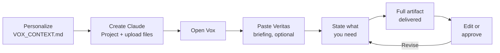

# Vox

**A Claude-based career strategy workspace.**

Vox is a Claude Project configured to support a job search at a senior level. It covers cover letter writing, resume editing, interview prep, outreach drafting, and pipeline strategy. The design pattern is replicable: anyone with a Claude account can follow these instructions and stand up the same setup.

This README documents the architecture, file structure, and setup process. It pairs with [Veritas](https://itworkssly.github.io/veritas), the AI-native job evaluation and pipeline tracking tool in this repo. Together, they form a two-tool job search intelligence system.

---

## What Vox Does

Vox is a Claude Project, not a chat thread. The Project persists a system prompt and a set of uploaded reference files across every session. When you open it, context is already loaded. You start working immediately.

**Vox handles:**
- Cover letters, tailored to each role and styled as formatted `.docx` files
- Resume edits, targeted to specific job descriptions
- Interview prep: company intel infographics, flashcard sets, talking points
- Outreach drafts: recruiter notes, warm reconnects, cold CPO messages
- Pipeline strategy: how to frame a gap, manage competing offers, sequence outreach
- LinkedIn content: posts, About sections, headlines

The system prompt defines a panel of specialist personas that activate based on the task. A copy editor cuts the prose, a recruiter reads your materials the way a hiring manager would, a comp analyst models the numbers behind a negotiation. You get one unified output, not a transcript of the panel talking.

---

## How It Connects to Veritas

Veritas evaluates roles and tracks a job search pipeline. When you want to bring that context into a writing or strategy session, Veritas generates a **Vox Pipeline Briefing**, a structured markdown block you copy and paste at the start of a Vox session. Vox reads it as the live source of truth for that session.

The two tools share no data natively. The briefing is the handoff. You control what crosses.

---

---

## Why This Works

Most AI-assisted job search setups fail for the same reason: the context resets every session. You paste your resume, describe your background, explain what you're looking for, then do it again the next day. The output is as generic as the input.

Claude Projects solve this. A Project persists a system prompt and a set of uploaded files across every session. When you open Vox, it already knows your full career history, your target roles, your comp requirements, your voice, and your gaps. You start working immediately.

**This design pattern is the entire point.** The intelligence lives in the reference files, `VOX_CONTEXT.md` in particular, not in the prompts you type. A well-built context file produces specific, usable outputs. A thin one produces polished noise that sounds like you could have written it about anyone.

The persona architecture matters too. A single AI assistant doing everything tends toward a competent middle. Vox activates specific specialist frames based on the task: an Editor who cuts aggressively, a Recruiter who reads your materials the way a hiring manager reads them, an Insider who knows what lands at FAANG-scale. You get one output, not a committee discussion. The output has been pressure-tested by multiple lenses before it reaches you.

**Why not a custom GPT or a LangChain agent?** Custom GPTs have shallower context windows and no project-level file persistence. A LangChain agent introduces engineering complexity and runtime cost for a problem that doesn't need them. There's no external API to call, no database to query, no multi-step reasoning chain to orchestrate. The problem is context management and writing quality, and Claude Projects solve both natively. The simpler the architecture, the less that can break.

---

## How to Use Vox




A typical session looks like this:

1. Open the Vox Project in Claude.
2. If you want pipeline context, paste a Vox Pipeline Briefing generated from Veritas.
3. State what you need. One sentence is usually enough: "Write a cover letter for this role" + paste the JD. Or: "Build me interview prep for GitHub, Head of People Analytics."
4. Vox delivers the full artifact. Not an outline, the thing itself.
5. Give feedback on specific sentences or sections. Iterate.
6. Save to Google Drive if connected, or copy and use directly.

No trigger phrase is required. The system prompt activates when you open the Project.

---

## What a Session Looks Like

Here is a real exchange pattern for a cover letter, condensed:

> **You:** Write a cover letter for this role. [paste JD]
>
> **Vox:** [delivers a full, styled cover letter in your voice, with a hook tied to the company's specific language, your most relevant employers and accomplishments in the bullets, and a clean close, with no "I am excited to apply for this position"]
>
> **You:** The third bullet is too long and leads with "we." Fix it.
>
> **Vox:** [delivers the revised bullet, shorter, first-person, without restating what changed]

That's the whole loop. No requirement-gathering. No clarifying questions about your background. No generic opener you have to delete. The specificity comes from `VOX_CONTEXT.md`, not from what you type in the session.

For interview prep:

> **You:** Build me interview prep for GitHub, Senior People Analytics role.
>
> **Vox:** [delivers a company intel infographic, a tap-to-reveal flashcard set covering your pitch, known gaps, two or three STAR stories, questions to ask, and key facts about the company, plus a stock chart with RSU vesting seasonality if equity is in the offer]

One message. One complete prep package.

## File Structure

```
/vox
  README.md                  ← this file
  VOX_SYSTEM_PROMPT.md       ← the core system prompt loaded into the Claude Project
  VOX_CONTEXT.md             ← your professional context: background, accomplishments, gaps, voice
  STYLE_GUIDE.md             ← writing rules enforced on every output
  WORKFLOW_updated.md        ← step-by-step workflows for cover letters and JD analysis
  veritas_profile.json       ← your Veritas profile (optional, keeps tools in sync)
  PERSONA_*.md               ← 21 specialist persona files (see list below)
```

### Persona Files

| File | Role |
|---|---|
| `PERSONA_architect.md` | Code integrity, single-file structure, state management |
| `PERSONA_delivery_lead.md` | Veritas build decisions, cross-session codebase state, dev-vs-prep triage |
| `PERSONA_copy_editor.md` | All written assets, anti-AI voice enforcement |
| `PERSONA_recruiter.md` | Resume-JD alignment, pipeline state, screening scorecard |
| `PERSONA_hiring_manager.md` | Pain-point diagnostics, 90-day deliverable framing |
| `PERSONA_sourcer.md` | JD intake and token compression |
| `PERSONA_data_scientist.md` | Scoring algorithms, weighted matrices, JS math logic |
| `PERSONA_io_psychologist.md` | Behavioral competency mapping, STAR calibration |
| `PERSONA_interviewer.md` | Mock interview loops, stress-test follow-ups, hire ratings |
| `PERSONA_exec_coach.md` | Offer negotiation, late-stage pipeline strategy |
| `PERSONA_networking_maven.md` | Cold outreach, backchannel targeting |
| `PERSONA_pm_advocate.md` | PM positioning, ROI framing, resume bullet rewrites |
| `PERSONA_telemetry.md` | Funnel health, conversion diagnostics, JS analytics logic |
| `PERSONA_ai_builder.md` | AI-native positioning, framing Veritas as proof of capability |
| `PERSONA_comp_analyst.md` | Comp modeling from intake through offer |
| `PERSONA_narrative_architect.md` | Career through-line, origin story, arc above the bullet |
| `PERSONA_strategist.md` | Pipeline-wide time allocation across competing processes |
| `PERSONA_skeptic.md` | Audits inputs a decision rests on before it locks |
| `PERSONA_contrarian.md` | Argues the opposite side of a settled plan to surface blind spots |
| `PERSONA_outsider.md` | Forces plans into plain English, names what the insider missed |
| `PERSONA_expansionist.md` | Counterweight to playing small, questions the self-imposed ceiling |

---

## Setup

**Requirements:** A Claude account (Pro or higher recommended). No API key needed for basic use.

### Step 1: Create a Claude Project

1. Open [claude.ai](https://claude.ai) and navigate to **Projects**.
2. Create a new Project. Name it whatever makes sense: `Vox`, your name, anything.
3. You will add a system prompt and upload reference files in the next two steps.

### Step 2: Load the System Prompt

1. Open your Project settings.
2. Copy the contents of `VOX_SYSTEM_PROMPT.md` from this repo.
3. Paste it into the **Custom Instructions** field.

This is the core instruction set. It defines how Vox operates, what voices activate, and what rules apply to every output.

### Step 3: Upload Reference Files

Upload the following files to the Project knowledge base:

- `VOX_CONTEXT.md` is your professional background. Edit this before uploading to reflect your own history, target roles, comp requirements, and known gaps.
- `STYLE_GUIDE.md` holds the writing rules. Edit or replace to match your voice.
- `WORKFLOW_updated.md` is optional but useful for cover letter and JD workflows.
- Any persona files relevant to your use case. At minimum: `PERSONA_copy_editor.md` and `PERSONA_recruiter.md`.

You can add or remove files anytime. The Project re-reads them on each session start.

### Step 4: Personalize VOX_CONTEXT.md

This is the most important step. `VOX_CONTEXT.md` is what gives Vox specificity. Without it, outputs will be competent but generic.

The file should include:

- **Professional summary**: 3-5 sentences, direct, no puffery
- **Career history**: roles, companies, dates, scope, what you actually owned
- **Key accomplishments**: specific, metric-driven, tied to real work
- **Target roles and companies**: level, function, geography, remote preference
- **Comp floor**: exact number, include equity requirements
- **Known gaps**: be direct. Own them briefly, then pivot to adjacent strength.
- **Voice**: how you write, what words you avoid, what sounds wrong to you

The more specific you are, the better the outputs. Vague context produces vague cover letters.

### Step 5: Connect Google Drive (Optional)

If you want Vox to save `.docx` outputs directly to your Drive:

1. Enable the Google Drive integration in Claude's **Integrations** settings.
2. Note your target folder ID from the Drive URL.
3. Add the folder ID to your `VOX_CONTEXT.md` under a `## Google Drive` section.

Vox will offer to save long-form outputs once this is connected.

---

## Using Vox

### Starting a Session

Open the Project and start typing. No trigger phrase required, though the system prompt references "Vox" as the activation signal. If you want to bring in pipeline context from Veritas, paste the Pipeline Briefing first.

### Cover Letters

Paste the job description and say what you want. Vox will follow the workflow in `WORKFLOW_updated.md`: extract company language, map to your background, draft a tailored letter in your voice. Output is a styled `.docx` using your configured template.

### Interview Prep

Say: `Build me interview prep for [Company] [Role]`. Vox generates a company intel infographic, a tap-to-reveal flashcard set (pitch, gaps, stories, questions, facts), and targeted talking points. If equity is involved, it adds a stock chart with RSU seasonality.

### JD Analysis

Paste a job description. Vox runs a four-step analysis: extract company language and rank by importance, rewrite your resume bullets in that language, score your resume against the JD, and give you a 10-second hiring manager read.

### Outreach

Describe the situation. Vox distinguishes between cold outreach (no job-seeking signal), recruiter notes after applying (lead with the application), and warm reconnects (lead with what you've built). It follows the Laszlo Bock "ask for advice, not a job" framework by default for cold messages.

---

## Design Principles

A few decisions worth understanding if you adapt this system:

**Context over prompting.** Most of the work happens in the reference files, not in the prompts you type. This is the central design decision, and the one most people get backwards when they try to build AI-assisted workflows. They spend energy on clever prompts and get generic outputs because the model has nothing specific to work with. A detailed `VOX_CONTEXT.md` with real accomplishments, real numbers, honest gaps, and actual voice produces outputs that sound like a specific person made them. A thin one produces polished noise. The prompt just directs the work. The context is the work.

**Full artifacts, not outlines.** Vox is configured to produce the complete deliverable (a full cover letter, a full flashcard set, a full email), not a skeleton to fill in. If the output needs editing, edit it. Don't ask for a draft.

**One question per session.** If a task is genuinely ambiguous, Vox asks one clarifying question before starting. Not a list. This keeps sessions from turning into requirement-gathering exercises.

**Style rules as a linter.** The STYLE_GUIDE runs in the background on every output. No em dashes. No AI vocabulary. No passive voice. No rule-of-three. These aren't preferences, they're constraints. The output either passes or it doesn't.

---

## Adapting This System

You are not **itworkssly**. Here is what you need to change to make this yours:

1. **`VOX_CONTEXT.md`**: replace entirely with your own background. This is the highest-leverage edit.
2. **`STYLE_GUIDE.md`**: keep the structure, update the banned words and voice rules to match how you write.
3. **Cover letter template settings**: the `.docx` template specs in `WORKFLOW_updated.md` reference specific fonts, colors, and margins. Update to match your preferred format.
4. **Persona files**: keep what's relevant, drop what isn't. If you're not a PM, `PERSONA_pm_advocate.md` won't help you.

The system prompt in `VOX_SYSTEM_PROMPT.md` is portable as-is for most senior IC or people manager job searches. The persona panel applies broadly across roles. You may want to update industry-specific references in the personas that assume a particular function or company scale.

---

## Companion Tool

**Veritas** is AI-native job evaluation and pipeline tracking, also in this repo.

- Live: [itworkssly.github.io/veritas](https://itworkssly.github.io/veritas)
- Requires your Anthropic API key (never stored server-side)
- Evaluates roles across four dimensions: Domain Fit, Growth Signal, Culture Signal, Comp & Logistics
- Generates a Pipeline Briefing you paste into Vox to share context across sessions

---

## License

MIT. Fork it, adapt it, share what you build.
